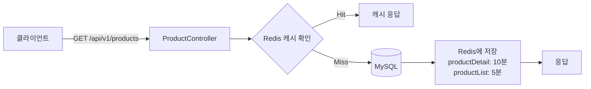
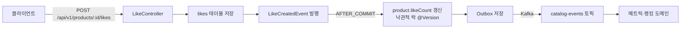

# Architecture — 상품 카탈로그

> 정책 인덱스 + 데이터 흐름. 코드 구조/ERD는 ontology와 코드에 위임합니다.

## 데이터 흐름

### 상품 조회 (캐시 포함)

### 좋아요 이벤트 흐름

## 정책 인덱스

| 주제 | 책임 entity | 핵심 정책 |
|------|-------------|----------|
| [브랜드](브랜드/README.md) | `brand` | 브랜드 CRUD, 어드민 전용 생성/수정/삭제 |
| [상품 조회](상품-조회/README.md) | `product` | Redis 캐시, 정렬 옵션(LATEST/PRICE_ASC/LIKES_DESC), 캐시 무효화 |
| [좋아요](좋아요/README.md) | `like` | 낙관적 락, LikeCreatedEvent/LikeCancelledEvent, Kafka 발행 |

## 의존하는 인프라

| infra | 용도 |
|-------|------|
| `mysql` | 브랜드·상품·좋아요 마스터 |
| `redis` | 상품 상세(10분)·목록(5분) 캐시 |
| `kafka` | catalog-events 토픽 (메트릭·랭킹 도메인으로 이벤트 전달) |
