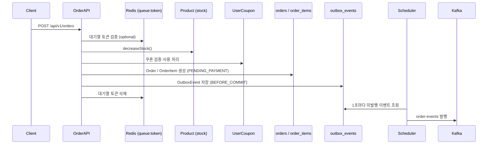
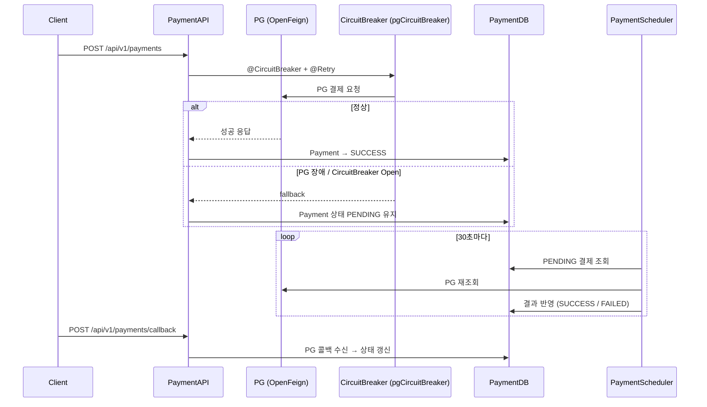

# Architecture — 주문/결제/쿠폰

> 작성일: 2026-05-14 | 수정일: 2026-05-14 | 유형: 정책 | 관련 레포: letsgojh0810/commerce-backend

## 정책 인덱스

| 주제 | 핵심 정책 |
|------|----------|
| [주문 생성](주문-생성/README.md) | 대기열 토큰 검증, 재고 차감, 쿠폰 사용, OutboxEvent, 토큰 삭제 |
| [결제 흐름](결제-흐름/README.md) | PG 연동, CircuitBreaker, PaymentScheduler 30초 재조회 |
| [쿠폰 규칙](쿠폰-규칙/README.md) | FIXED/RATE 타입, 동기/비동기 발급, UserCoupon 상태 |
| [환불 정책](환불-정책/README.md) | 주문 취소 기반 환불, 재고·쿠폰 복구, payment_cancel_requests |

## 주문 생성 전체 흐름

## 결제 흐름 (PG + CircuitBreaker)

## 정책 테이블

| 항목 | 정책 |
|------|------|
| 주문 생성 상태 초기값 | PENDING_PAYMENT |
| 결제 성공 상태 | PAID |
| 주문 취소 상태 | CANCELLED |
| PG 장애 시 동작 | Payment PENDING 유지 → PaymentScheduler 재조회 |
| Outbox 발행 주기 | 1초 |
| PaymentScheduler 주기 | 30초 |
| 쿠폰 타입 | FIXED (고정액), RATE (비율) |
| 비동기 쿠폰 발급 토픽 | coupon-issue-requests |
