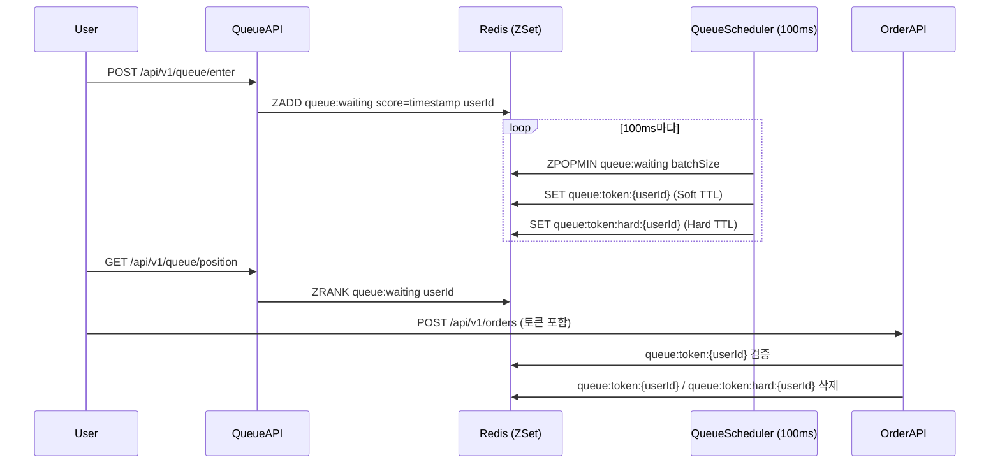

# Architecture — 선착순 대기열

> 작성일: 2026-05-14 | 수정일: 2026-05-14 | 유형: 정책 | 관련 레포: letsgojh0810/commerce-backend

## 전체 흐름

## Hard TTL + Soft TTL 이중 토큰 구조

| 키 | 역할 |
|----|------|
| `queue:token:{userId}` | Soft TTL 토큰. 주문 생성 시 검증 대상. |
| `queue:token:hard:{userId}` | Hard TTL 토큰. 만료 시 자동 무효화. Soft TTL 연장 상한선 역할. |

Soft TTL은 사용자가 활동 중일 때 갱신될 수 있으나, Hard TTL이 만료되면 무조건 입장 권한이 소멸됩니다. 이를 통해 입장 권한을 무한정 유지하는 것을 방지합니다.
