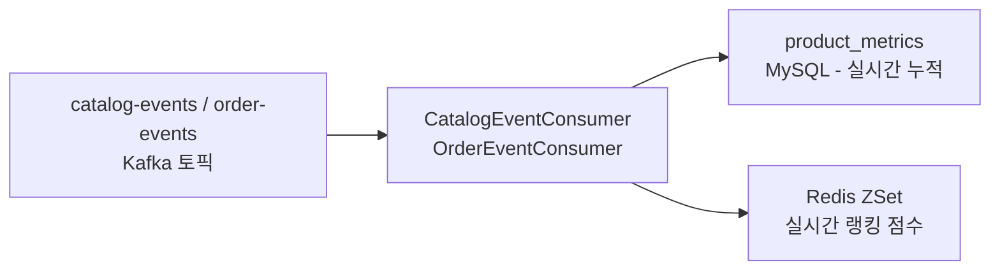
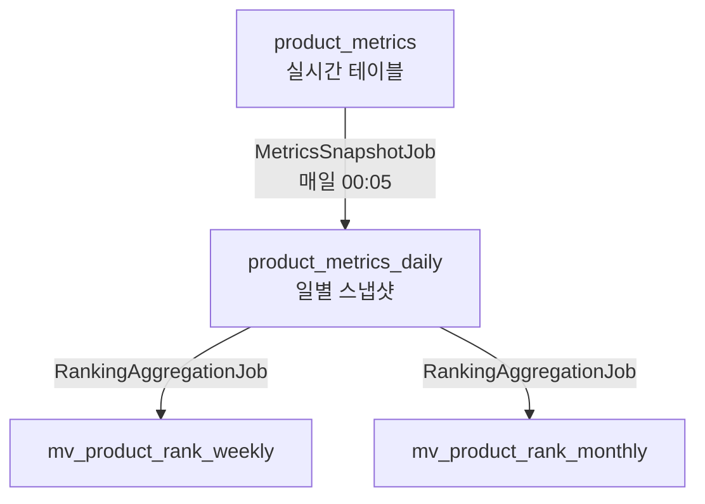

# Architecture — 랭킹/메트릭

> 작성일: 2026-05-14 | 수정일: 2026-05-14 | 유형: 정책 | 관련 레포: letsgojh0810/commerce-backend

## 실시간 메트릭 수집 흐름



| 이벤트 | 처리 |
|--------|------|
| `LIKE_CREATED` | likeCount +1, Redis addLikeScore |
| `LIKE_CANCELLED` | likeCount -1 |
| `PRODUCT_VIEWED` | viewCount +1, Redis addViewScore |
| `ORDER_COMPLETED` | salesCount +N, Redis addOrderScore |

## Spring Batch 집계 흐름



## RankingCarryOverScheduler

매일 23:50에 실행됩니다. 당일 Redis ZSet 점수의 10%를 다음날로 이월하여 랭킹의 연속성을 유지합니다.

```
다음날 초기 점수 = 당일 점수 × 0.1
```
