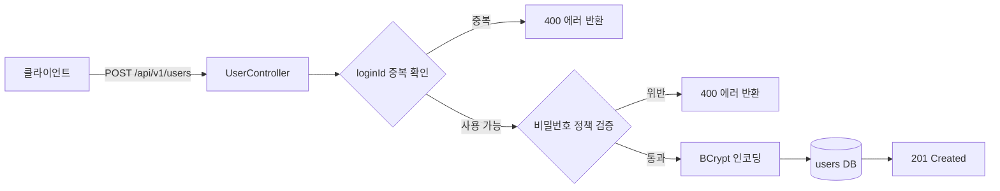
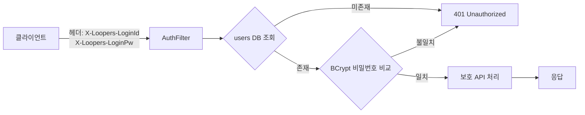

# Architecture — 사용자

> 정책 인덱스 + 데이터 흐름. 코드 구조/ERD는 ontology와 코드에 위임합니다.

## 데이터 흐름

### 회원가입 흐름

### 보호 API 인증 흐름

## 정책 인덱스

| 주제 | 책임 entity | 핵심 정책 |
|------|-------------|----------|
| [회원가입·인증](회원가입-인증/README.md) | `user` | loginId 중복 불가, 비밀번호 정책, BCrypt 인코딩, 헤더 기반 인증 |
